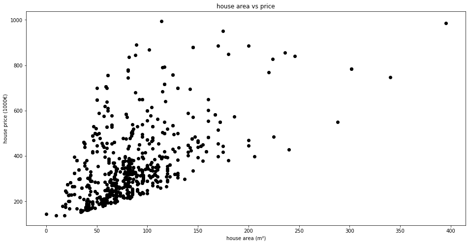
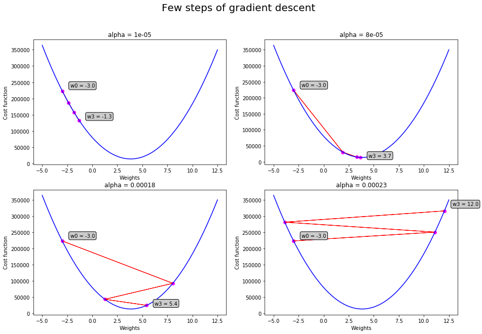

# Lab 1: Linear Regression

In this practice session, you are invited to train a linear regression model using gradient descent method. After the learning phase, your model should predict house prices in the region of _Ile-de-France_ given their areas (in m²) and their numbers of rooms.

We will also enhace the perfomence of the learning algorithm using different implementation techniques like vectorization and features normalization.

## Import libraries and load data
Import **numpy** library that support matrix operation and **matplotlib** library for plotting data.  


```python
import numpy as np
import matplotlib.pyplot as plt
```

## Question 1

The _house.csv_ file contains $d=3$ columns that represent the area, the number of rooms and the price of $n=600$ houses (one per row). 

- Open this file with a file editor to understand more the data. 
- Load the data and check its size.

**Hint:** You could use [loadtxt](https://docs.scipy.org/doc/numpy-1.13.0/reference/generated/numpy.loadtxt.html) function from numpy library.


```python
house_data = np.loadtxt('house.csv') 
print(house_data.shape)
```

    (600, 3)


```python
X = house_data[:,0]
y = house_data[:,2]
print(y.shape)
```

    (600,)


## Question 2
* Extract the house area and price columns respectively in $X$ and $y$ lists.
* Scatter prices against areas.


```python
X = house_data[:,0]
y = house_data[:,2]

plt.figure("Visualize house data",figsize=(16,8))
plt.scatter(X, y,  color='black')
plt.xlabel('house area (m²)')
plt.ylabel('house price (1000€)')
plt.title('house area vs price')
plt.show()
```





## Question 3
The cost function we will use for this linear model training is the **Mean Squared Error** function defined by $$L(w) = MSE(X \cdot w, y) = \frac{1}{2n} \sum_{i=1}^{n}{( x_i \cdot w - y_i)^2}$$
First of all, transform $X$ and $y$ to be two $(n,1)$-numpy arrays.


```python
X, y = np.array(X).reshape(-1, 1), np.array(y).reshape(-1, 1)  
```

## Question 4
Implement the mean squared error cost function. Then implement its gradient : $$\nabla L(w) = \partial_{w} MSE(X \cdot w, y) = \frac{1}{n} \sum_{i=1}^{n}{(x_i \cdot w - y_i)~x_i} =\frac{1}{n} X^{\top}(X \cdot w - y)$$


```python
def MSE(y_true, y_pred):
    return .5*np.mean((y_pred - y_true)**2)

def dMSE(XX, y_true, y_pred):
    return np.dot(XX.T, y_pred-y_true)/XX.shape[0]

cost_func = (lambda w : MSE(y, np.dot(X,w)))
grad_cost_func = (lambda w : dMSE(X, y, np.dot(X,w)))
```

**Note :** Check [mean_squared_error](https://scikit-learn.org/stable/modules/generated/sklearn.metrics.mean_squared_error.html). 

## Question 5
The update equation of the gradient descent algorithm is given by: $$w^{(t+1)}=w^{(t)}-\alpha \nabla L(w^{(t)}) $$
Where $\alpha$ represents the step or the **learning rate**.
* Compute three steps of the gradient descent with different values of $\alpha$.
 * Hint : To select the best value of $\alpha$, we could start by small values and increase it progressively. We should select the highest value of $\alpha$ before the algorithm diverge. The rule of thumbs for varying $\alpha$ is to increase it by factor of 3. For example, we could select $\alpha=0.0001,~0.0003,~0.001,~0.003,~0.01,~0,03,~0.1 \dots$
* For each $\alpha$, plot $w \to L(w)$, your initial point $(w_0, L(w_0))$ and the three points associated to $w_1$, $w_2$ and $w_3$ you've just computed. 
* What is the best $\alpha$ according to you ?


```python
fig, axs = plt.subplots(2, 2, figsize=(15,10))
fig.suptitle('Few steps of gradient descent', fontsize=20)
bbox = dict(boxstyle="round", fc="0.8")

Weights = np.linspace(-5,12.5,100)
Loss = [cost_func(w) for w in Weights]

for ax, alpha in zip(axs.reshape(4), (0.00001, 0.00008, 0.00018, 0.00023)):
    w0 = np.array([[-3]]) # Why ?
    cost_init = cost_func(w0)
    step = 0
    
    ax.plot(Weights, Loss,  color='blue')
    ax.scatter(w0, cost_init, color="magenta")
    ax.annotate("w%i = %.1f"%(step, w0), (w0, cost_init), xytext=(w0+0.8, 1.051*cost_init), bbox=bbox)

    while step < 3:
        grad = grad_cost_func(w0)
        w1 = w0 - alpha * grad 
        new_cost = cost_func(w1)

        # plot cost function, w0 point and the gradient direction
        ax.scatter(w1, new_cost, color="magenta")
        ax.arrow(w0[0,0], cost_init, (w1-w0)[0,0], new_cost-cost_init, color='red') # Why [0,0] ?
        
        # update for next step
        step += 1
        w0 = w1
        cost_init = cost_func(w0)
        
    ax.annotate("w%i = %.1f"%(step, w0), (w0, cost_init), xytext=(w0+0.8, 1.051*cost_init), bbox=bbox)
    ax.set_xlabel('Weights')
    ax.set_ylabel('Cost function')
    ax.set_title('alpha = {}'.format(alpha))
```





## Question 6

Implement the gradient descent algorithm, taking as input the gradient function, the learning rate, one or several stopping criterions and an initial parameter $w_0$.


```python
def grad_descent(grad, w0, alpha=0.00008, max_iter=None, tol=1e-3):
    step = 0
    err = tol+1
    
    # Transform w0 to the right dimension : (d, 1)
    w0 = np.array(w0)
    if w0.ndim == 1:
        w0 = w0.reshape(-1, 1)
    elif w0.ndim == 0:
        w0 = w0.reshape(1, 1)
        
    if max_iter is None:
        max_iter = np.inf

    # Updating loop until convergence
    while step < max_iter and err > tol:
        w1 = w0 - alpha * grad(w0)
        step += 1
        err = np.sqrt(((w1-w0)**2).sum())
        w0 = w1

    print('Converged in {} steps with precision {}'.format(step, err))
    print("The optimal parameter is: ", w1.T[0])

    return w1.T[0]
```
