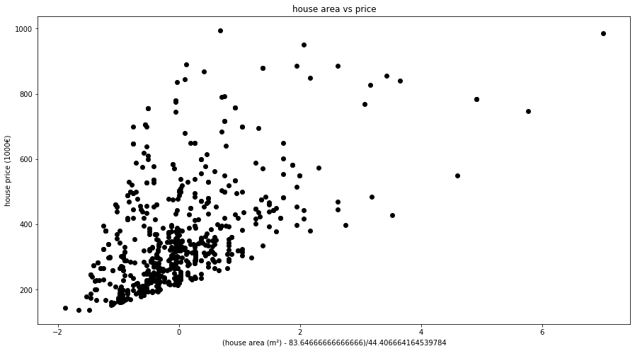
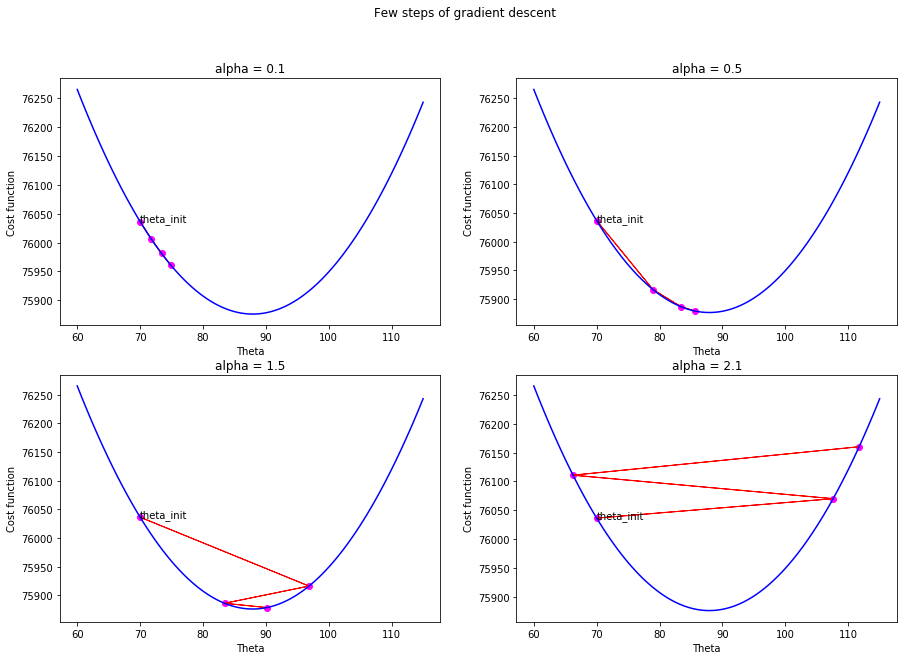
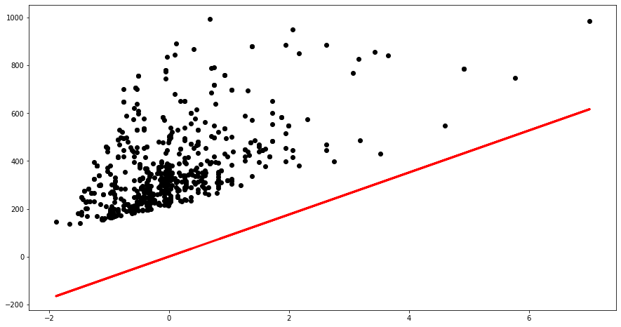
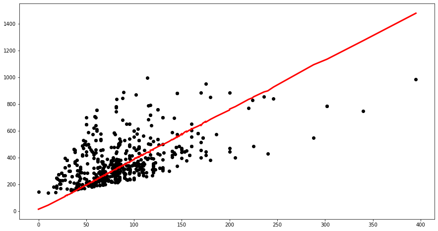

In this practice session, you are invited to train a linear regression model using gradient descent method. After the learning phase, your model should predict house prices in the region of _Ile-de-France_ given their areas (in m²) and their numbers of rooms.

We will also enhace the perfomence of the learning algorithm using different implementation techniques like vectorization and features normalization.

## Import libraries and load data
Import **numpy** library that support matrix operation and **matplotlib** library for plotting data.  
### Question 1

The _house.csv_ file contains 3 columns that represent the area, the number of rooms and the price of 600 houses (one per row). 

- Open this file with a file editor to understand more the data. 
- Load the data and check its size.

**Hint:** You could use [loadtxt](https://docs.scipy.org/doc/numpy-1.13.0/reference/generated/numpy.loadtxt.html) function from numpy library.


```python
import numpy as np
import matplotlib.pyplot as plt

house_data = np.loadtxt('house.csv') 

print(house_data.shape)
print(house_data)
```

    (600, 3)
    [[122.   6. 361.]
     [125.   6. 759.]
     [ 79.   4. 584.]
     ...
     [ 86.   4. 332.]
     [ 64.   3. 246.]
     [100.   5. 249.]]


## Linear regression with 1 feature

In this first part, we will train a linear model for house price prediction using only one feature the house area. We will start by implementing a cost function and the gradient of this cost function. Then, we will implement the gradient descent algorithm that minimizes this cost function and determine the linear model parameter $\theta$ in the equation $$h_\theta(x)=\theta x$$ 

### Question 2
* Save the number of samples **n**.
* Extract the house area and price columns respectively in **X** and **y** lists to visualize them.
 * **Hint :** If you are using **Numpy** arrays, you need will need a $(600, 1)$-sized array. You can use **numpy.reshape** or **numpy.newaxis**.
* Normalize the house area feature.


```python
n = house_data.shape[0]
X = house_data[:,0].reshape(-1, 1)
y = house_data[:,2, np.newaxis] # Does the exact same thing as the previous line
print('X shape : {}, y shape : {}'.format(X.shape, y.shape))

# Normalization
X_mean = X.mean()
X_std = X.std()
X = (X-X_mean)/X_std

plt.figure("Visualize house data",figsize=(15,8))
plt.scatter(X, y,  color='black')
plt.xlabel('(house area (m²) - {})/{}'.format(X_mean, X_std))
plt.ylabel('house price (1000€)')
plt.title('house area vs price')
plt.show()
```

    X shape : (600, 1), y shape : (600, 1)





**Observation:** : We note a pattern in the data scatter. it is spread on both side of a line. Hence, the house area and price are correlated and we could build a model that try to predict a house price based on its area.

### Question 3
The cost function we will use for this linear model training is the **Mean Squared Error**. Implement the cost function defined by $$J(\theta) = MSE(\theta ; X, y) = \frac{1}{2n} \sum_{i=1}^{n}{( \theta \cdot x_i - y_i)^2} = \frac{1}{2n} \| X \cdot \theta - y \|^2$$


```python
def MSE(theta, XX, yy):
    nn = len(yy)
    return np.sum((np.dot(XX,theta)-yy)**2)/(2*nn)

cost_func = (lambda theta : MSE(theta, X, y))
```

### Question 4

Implement the gradient of the Mean Squared Error cost function : $$\nabla J(\theta) = \partial_{\theta} MSE(\theta ; X, y) = \frac{1}{n} \sum_{i=1}^{n}{(\theta \cdot x_i - y)~x_i} = \frac{1}{n} X^{\top} (X \cdot \theta - y)$$


```python
def dMSE(theta, XX, yy):
    nn, kk = XX.shape
    if kk > 1:
        theta = theta.reshape(kk, 1)
    residual = np.dot(XX,theta)-yy
    return np.dot(XX.T, residual)/nn

grad_cost_func = (lambda theta : dMSE(theta, X, y))
```

### Question 5
The update equation of the gradient descent algorithm is given by: $$\theta^{(t+1)}=\theta^{(t)}-\alpha \nabla J(\theta^{(t)}) $$
Where $\alpha$ represents the step or the **learning rate**. Compute twos or three steps of the gradient descent with different values of $\alpha$. Choose the best one according to you. Comment what you see.


```python
fig, axs = plt.subplots(2, 2, figsize=(15,10))
fig.suptitle('Few steps of gradient descent')

Theta = np.linspace(60,115,100)
J = [cost_func(t) for t in Theta]

for ax, alpha in zip(axs.reshape(4) , (0.1, 0.5, 1.5, 2.1)):
    # evaluate gradient of cost function at theta_init 
    theta_init = 70
    cost_init = cost_func(theta_init)

    steps = 3
    
    ax.plot(Theta, J,  color='blue')
    ax.scatter(theta_init, cost_init, color="magenta")
    ax.annotate("theta_init", (theta_init, cost_init))

    while steps > 0:
        grad = grad_cost_func(theta_init)
        new_theta = theta_init - alpha * grad[0,0] # That's because we are in the special case of theta being scalar
        new_cost = cost_func(new_theta)

        # plot cost function, theta_init point and the gradient direction
        ax.scatter(new_theta, new_cost, color="magenta")
        ax.arrow(theta_init, cost_init, new_theta-theta_init, new_cost-cost_init, color='red')
        
        # update for next step
        steps -= 1
        theta_init = new_theta
        cost_init = cost_func(theta_init)

    ax.set_xlabel('Theta')
    ax.set_ylabel('Cost function')
    ax.set_title('alpha = {}'.format(alpha))
```





### Question 6

- Implement the gradient descent algorithm, taking as input the gradient function, the learning rate, the stopping criterion and the initial parameter $\theta_0$.
- Compute the optimal parameter $\theta_{opt}$.
- Compare on the same axis the house prices in function of their areas and the prices predicted by the linear model in  function of the areas.


```python
def grad_descent(grad, theta0, max_iter=100, alpha=0.0001):
    i = 0
    theta = np.array(theta0)
    if len(theta.shape) == 1:
        theta = theta.reshape(-1, 1)
    while i < max_iter:
        theta = theta - alpha * grad(theta)
        i += 1
    return theta

# calculate the optimal value of theta that minimize cost function
theta_opt = grad_descent(grad_cost_func, theta0=10, alpha=0.5)
print("The optimal value of theta that minimize cost function is: ", theta_opt)

# predict house price using the calculated value of optimal theta
predicted = np.dot(X, theta_opt)
print("Final error = ", cost_func(theta_opt))

# plot linear model and data 
plt.figure('Regression Model', figsize=(15,8))
plt.scatter(X, y,  color='black')
plt.plot(X, predicted, color='red', linewidth=3)
plt.show()
```

    The optimal value of theta that minimize cost function is:  [[87.90468243]]
    Final error =  75876.07007020294





## Linear regression with 3 features

In this part, we will train a linear model for house price prediction using the house area, number of rooms and the bias term that represents the constant term in the linear model equation $$h_\theta(x)=\theta_2 x_2+\theta_1 x_1+\theta_0$$

### Question 7
- Modify **X** to contain the number of rooms.
- This time don't normalize data. Be careful to what should happen to $\alpha$, $\theta$ and your stopping criterion.
- Take the bias term into account.


```python
def add_bias(XX):
    nn = XX.shape[0]
    return np.concatenate([np.ones((nn,1)), XX], axis=1)

X = add_bias(house_data[:, 0:2])
print(X)
```

    [[  1. 122.   6.]
     [  1. 125.   6.]
     [  1.  79.   4.]
     ...
     [  1.  86.   4.]
     [  1.  64.   3.]
     [  1. 100.   5.]]


### Question 8
Use $\theta_{opt}$ to estimate the prices in the data set. Compare to real prices.


```python
# Compute the new gradient
house_areas = X[:,1]
grad_cost_func = (lambda theta : dMSE(theta, X, y))

# calculate the optimal value of theta that minimize cost function
theta_opt = grad_descent(grad_cost_func, theta0=[0,0,0],
                         max_iter=1000, alpha=0.0001)
print("The optimal value of theta that minimize cost function is: ", theta_opt)

# predict house price using the calculated value of optimal theta
predicted = np.dot(X, theta_opt)
print("Final error = ", cost_func(theta_opt))

# plot linear model and data 
plt.figure('Regression Model', figsize=(15,8))
plt.scatter(house_areas, y, color='black')
plt.plot(np.sort(house_areas), predicted[np.argsort(house_areas, 0)], color='red', linewidth=3)
plt.show()
```

    The optimal value of theta that minimize cost function is:  [[4.32593624]
     [3.65470485]
     [3.33977319]]
    Final error =  13354.715292258847





### Question 9
You could also try to add other feature columns to the matrix X like $area^2$ or $area^{0.5}\dots~$ and see the effect on the model and the error.


```python
sqrt_areas = np.sqrt(house_areas.reshape(-1,1))
X = np.concatenate([X, sqrt_areas], axis=1)

grad_cost_func = (lambda theta : dMSE(theta, X, y))

# compute the optimal value of theta that minimize cost function
theta_opt = grad_descent(grad_cost_func, theta0=[0,0,0,0],
                         max_iter=1000, alpha=0.0001)
print("The optimal value of theta that minimize cost function is: ", theta_opt)

# predict house price using the calculated value of optimal theta
predicted = np.dot(X, theta_opt)
print("Final error = ", MSE(theta_opt, X, y))

# plot linear model and data 
plt.figure('Regression Model', figsize=(15,8))
plt.scatter(house_areas, y, color='black')
plt.plot(np.sort(house_areas, 0), predicted[np.argsort(house_areas, 0)], color='red', linewidth=3)
plt.show()
```

    The optimal value of theta that minimize cost function is:  [[ 3.39689722]
     [ 2.21047394]
     [ 2.09727736]
     [16.12000327]]
    Final error =  10834.914221452358


### Question 10

How much would cost a $330m^2$ flat with $5$ rooms ?


```python
x_to_predict = [1, 330, 5, np.sqrt(330)]
print("A 330m2 flat with 5 rooms would cost {} thousands euros".format(np.dot(x_to_predict, theta_opt)))
```

    A 330m2 flat with 5 rooms would cost [1036.17408496] thousands euros

